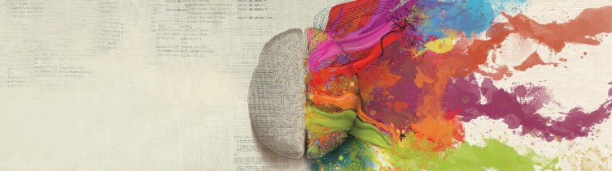

import author from '@/images/team/yuvraj.jpeg'

export const article = {
  date: '2019-11-20',
  title: "Simple, Easy & Quick ... Don't make me think",
  description:
    'I am going to talk about habits of human brain and how it sees new things. Our human brain is the most unique creation of god.',
  author: {
    name: 'Yuvraj Midha',
    role: 'UI/UX Designer',
    image: { src: author },
  },
}

export const metadata = {
  title: article.title,
  description: article.description,
}

## Introduction

I am going to talk about habits of human brain and how it sees new things. Our human brain is the most unique creation of god,

So, Let me start with an instance. For example, if a person wants to download an app, the first way is to search on it on google try different download links and then selecting the link which is spam-free OR the second way is to open a trusted website and simply download from the link. Of course we will choose the second way, it doesn’t matter if the app is a spam or not.

## But, why does it happens?

1. Most people are risk-averse. Low odds of success with big sacrifices of time and effort is not a very safe bet. Most people don’t enjoy challenges because they know they are not prepared to for it and will likely not succeed without sacrificing.

2. The second reason is our brain uses shortcuts, known as heuristics, to process information rapidly and efficiently, but these mental quick-fixes can sometimes lead to cognitive biases and decision-making errors.

## Puzzle : Find 5 words.

if I ask you to find 5 words whose first letter starts with ‘T’ ……………….

OK, it was very easy, right! So, if I ask you to find 5 words whose third letter is ‘T’ it will be more difficult.

But, let’s change the question, if I ask you find words which rhymes with ‘Mat’?

Easy right?

The reason is our brain plays tricks on us and stores it where we need it more frequently. Many businesses uses this trick to influence people and we do act like fools and think that this is easier for us.

> Aoccdrnig to a rscheearch at Cmabrigde Uinervtisy, it deosn’t mttaer in waht oerdr the ltteeers in a wrod are, the olny iprmoatnt tihng is taht the frist and lsat ltteer be in the rghit pclae.

## Use Emotions to remember things.

Another reason is the most influential past experience, a person would prefer traveling to a place which has faced no terror attacks in the past few years. Instances become more ‘available’ to your mind the more recent, unusual, and emotionally charge you are from them. Of course, the media know this, and often use it to their advantage. That’s why we often see media campaigns portraying emotionally-charged stories to raise awareness. The logic: the more emotionally-intense the material — the more ‘available’ it is in your mind — the more important you think it is — the more you will be drawn to take action.

## Conclusion

Human brain attracts with the things which are easier to do, that’s why ‘User Experience’ is a very important aspect in IT Industries. Easily recognizable ‘rhythm’, eye catching designs, easy-to-understand content etc etc……all these things always work good at attracting the customers.We hate waiting for others or do boring stuff because our brain doesn’t like to be free.So, if you want to do start-ups,run your own business, publicize your own product then these things will help you a lot.

